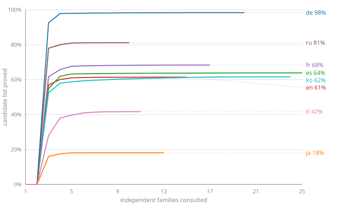

# The languages, and where each one stands

**The live version of this is [the chart](https://blinkered.github.io/blinkered-attestation/)**, which
reads each language's `status.json` from its own main branch. This file is the same thing as a
table, for reading on GitHub, and is regenerated by `pnpm roll`. Regenerating both is part of
[the rule for pushing a language](README.md#the-rule-for-changing-a-language).

**Nothing here is authoritative**: each language's numbers are measured in its own repository from
its own committed evidence. If the two disagree, the language repository is right and this is
stale.

Read the chart as _how much of its own candidate list a language could prove, against the number
of independent families it took_. The first two families of every language keep nothing, because
the rule needs three; a curve that climbs steeply at three and then flattens has found everything
its families can see, and a curve still climbing at twenty has more to gain from another
publisher.

| language | candidates | proved  | coverage  | families | checkable | returns stop at | conforms | ships    | published |
| -------- | ---------- | ------- | --------- | -------- | --------- | --------------- | -------- | -------- | --------- |
| `de`     | 36,493     | 36,346  | **99.6%** | 21       | 20        | 4               | yes      | yes      | yes       |
| `en`     | 174,456    | 112,115 | **64.3%** | 15       | 14        | 4               | yes      | yes      | yes       |
| `es`     | 201,655    | 145,334 | **72.1%** | 25       | 24        | 5               | yes      | yes      | yes       |
| `fr`     | 144,105    | 103,417 | **71.8%** | 17       | 16        | 5               | yes      | yes      | yes       |
| `id`     | 41,132     | 33,725  | **82.0%** | 6        | 4         | 4               | yes      | pending  | yes       |
| `it`     | 40,944     | 40,702  | **99.4%** | 7        | 5         | 4               | yes      | pending  | yes       |
| `ja`     | 191,188    | 40,571  | **21.2%** | 13       | 12        | 4               | yes      | **held** | yes       |
| `ko`     | 38,467     | 24,395  | **63.4%** | 24       | 23        | 5               | yes      | yes      | yes       |
| `nl`     | 322,146    | 159,228 | **49.4%** | 7        | 5         | 5               | yes      | pending  | yes       |
| `pt-BR`  | 200,241    | 153,146 | **76.5%** | 7        | 5         | 4               | yes      | pending  | yes       |
| `ru`     | 424,352    | 371,579 | **87.6%** | 10       | 8         | 4               | yes      | yes      | yes       |
| `tl`     | 23,306     | 12,579  | **54.0%** | 12       | 11        | 5               | yes      | yes      | yes       |
| `uk`     | 20,903     | 20,541  | **98.3%** | 6        | 4         | 4               | yes      | pending  | yes       |

**Ships** is the only column here that is not measured. Conforming says the evidence is sound and
Blinkered's own floor says the list deals a playable board; neither says anybody wants to ship it.
That decision travels in `status.json` beside the numbers, so nobody has to fetch two files that
could disagree. The build carries it forward rather than computing it, because no build should be
able to bless a language or withdraw one. **Absence means no**: a fresh clone, a deleted file or a
brand new language starts unblessed and has to be blessed on purpose.

**Ships** has three states, because two could not tell a decision apart from work not done.
`yes` is blessed. `held` means somebody looked and said no, and that language's `why`
says why — Japanese is held because its reader cannot build compound words, not because it failed
anything. `pending` means nobody has decided yet, which is where every language starts. Only
`yes` ships, and the chart draws the other two dashed.

**Checkable** is how many of a language's families somebody who disbelieved us could confirm by
fetching: a stable identifier, or a page we fetched ourselves. The rest are crawls somebody else
made, where the document holding the word is their published corpus rather than the web. Russian
passes the rule on four families and only two are checkable; Korean's twenty-three are all but one.
That difference is invisible in a coverage number and is the thing a sceptic would attack.

**Coverage is not a grade.** It is the share of somebody else's dictionary we could independently
prove, and a big dictionary full of inflected forms will score lower than a small one of ordinary
words however well the attestation went. German and French consulted the same five families and
differ by fifty points because German's candidate list is 36,000 words and French's is 144,000.

Every built language conforms: each ships only what its evidence supports.

Generated 2026-09-22 from the published repositories.
