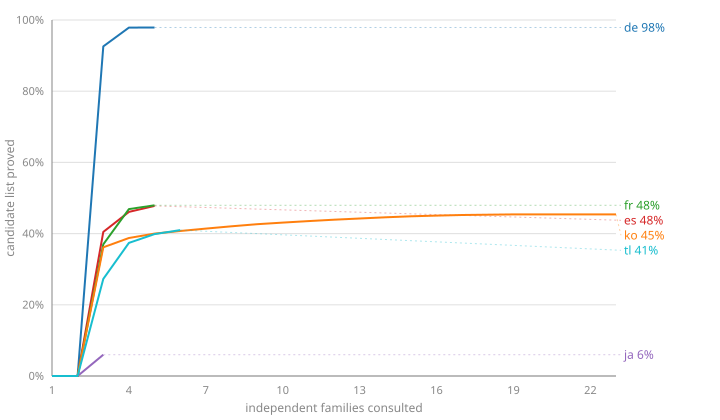

# The languages, and where each one stands

Generated by `node scripts/languages.mjs`, which reads every `blinkered-dictionary-*` beside
this repository. **Nothing here is authoritative**: each language's numbers are measured in its
own repository from its own committed evidence, and this is the roll-up. If the two disagree,
the language repository is right and this is stale.

Regenerating this is part of [the rule for pushing a language](README.md#pushing-a-language).

Read the chart as _how much of its own candidate list a language could prove, against the number
of independent families it took_. The first two families of every language keep nothing, because
the rule needs three; a curve that climbs steeply at three and then flattens has found everything
its families can see, and a curve still climbing at twenty has more to gain from another
publisher.

| language | candidates | proved | coverage  | families | returns stop at | evidence | conforms | published |
| -------- | ---------- | ------ | --------- | -------- | --------------- | -------- | -------- | --------- |
| `de`     | 36,493     | 35,725 | **97.9%** | 5        | 5               | 2 shards | yes      | no        |
| `en`     | not built  | —      | —         | —        | —               | —        | —        | no        |
| `es`     | 201,655    | 96,350 | **47.8%** | 5        | 5               | one file | yes      | no        |
| `fr`     | 144,105    | 69,104 | **48.0%** | 5        | 5               | one file | yes      | no        |
| `ja`     | 191,188    | 11,448 | **6.0%**  | 3        | still paying    | one file | yes      | no        |
| `ko`     | 38,467     | 17,465 | **45.4%** | 23       | 5               | one file | yes      | no        |
| `ru`     | not built  | —      | —         | —        | —               | —        | —        | no        |
| `tl`     | 23,306     | 9,247  | **39.7%** | 6        | 6               | one file | **NO**   | no        |

**Coverage is not a grade.** It is the share of somebody else's dictionary we could independently
prove, and a big dictionary full of inflected forms will score lower than a small one of ordinary
words however well the attestation went. German and French consulted the same five families and
differ by fifty points because German's candidate list is 36,000 words and French's is 144,000.

**1 language fails conformance and must not be published:** `tl` (every source is registered).

Generated 2026-09-21.
